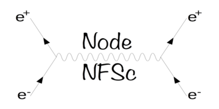

# node-nfsc

## tl;dr

NFS client bindings for node.js

## Using node-nfsc in your project

Add this entry in the ```dependencies``` section of your ```package.json``` file.

```javascript
"node-nfsc": "scality/node-nfsc",
```

## Usage

First, import the ```node-nfsc``` function into your program:

```javascript
const nfsc = require('node-nfsc');
```

Second, create an NFSv3 Client instance with the following arguments:

```javascript
var my_stash = new nfsc.V3({
    host: 'example.com',
    exportPath: '/my_stash'
});
```

Third, mount the filesystem and play with your data:

```javascript
let myfile_content;
my_stash.mount((err, root) => {
    if (err) {
        console.log(err);
        return;
    }
    my_stash.lookup(root, 'mydir', (err, mydir, mydir_attrs, root_attrs) => {
        if (err) {
            console.log(err);
            return;
        }
        my_stash.lookup(mydir, 'myfile', (err, myfile, myfile_attrs, mydir_attrs) => {
            if (err) {
                console.log(err);
                return;
            }
            my_stash.read(myfile,
                          myfile_attrs.size, 0,
                          (err, eof, buffer, myfile_attrs) => {
                if (err) {
                    console.log(err);
                    return;
                }
                myfyle_content = buffer;
            });
        });
    });
});
```

## Contributing

In order to contribute, please follow the
[Contributing Guidelines](
https://github.com/scality/Guidelines/blob/master/CONTRIBUTING.md).

